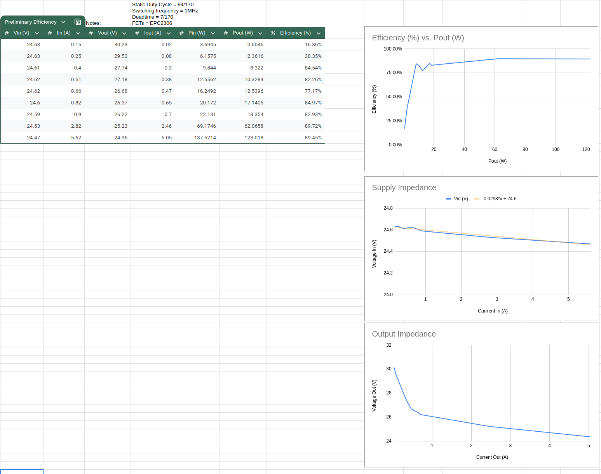
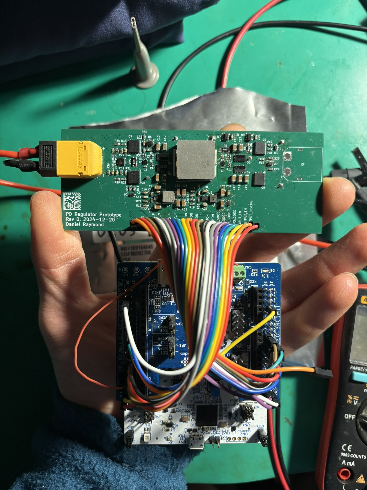
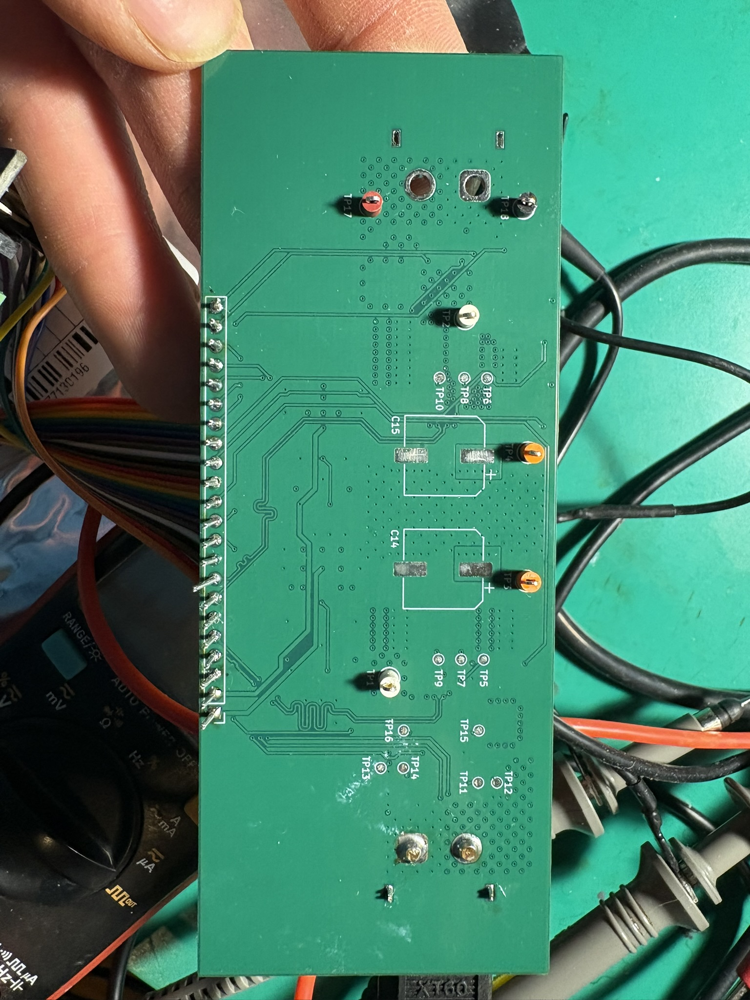

## Description
This prototype board is being used as a hardware test platform for the fully integrated project of the USB-C PD Charger. The PCB is designed to include all possible inputs/outputs and allow for troubleshooting, while interfacing with an off-the-shelf microcontroller board (NUCLEO-G431RB). Using discrete components that mirror the ideal setup will allow for full functionality and flexibilty in development.
## Testing
So far the board has been proven to work with ST's UCPDMon software as a Power Delivery Source and also control the 4-switch buck-boost controller.

