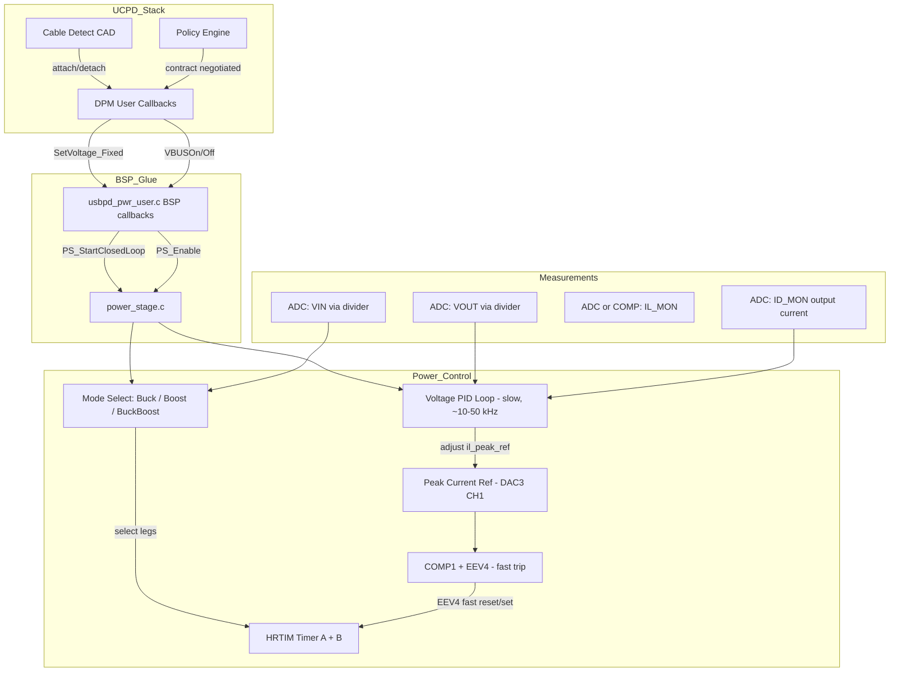

# PD Charger Firmware Plan — Buck-Boost + USB-PD Integration

## Project Summary

STM32G474RE-based USB-PD source with a 4-switch GaN buck-boost converter (EPC2302 FETs), targeting all SDR and EPR PDO voltages up to 48 V / 5 A from a variable DC input. The firmware uses STM32 UCPD middleware (PD3 Full stack), FreeRTOS, X-CUBE-TCPP with TCPP0203, and custom HRTIM peak-current-mode control in `power_stage.c`.

**Current state:**
- Buck mode peak-current-mode works (Timer A PWM, Timer B pass-through, COMP1/DAC3 CH1 trip via EEV4)
- Boost mode waveforms appear correct on scope but converter does not regulate
- No PID voltage feedback loop implemented (`PS_StartClosedLoop` declared but empty)
- UCPD middleware is initialized and running, but DPM callbacks are mostly stubbed
- PDO table only has 2x 5 V source PDOs

---

## 1. Boost Mode Root Cause Analysis

### Hardware Topology (from schematic page 2)

```
VIN ─► Q1(HS) ─┬─ R5(5mΩ) ─── L1(4.7µH) ─┬─ Q3(HS) ─► VOUT
                │                            │
         Q2(LS)─┘                     Q4(LS)─┘
         GND                          GND

Timer A: CHA1→Q1(HS), CHA2→Q2(LS)   [Buck leg]
Timer B: CHB1→Q3(HS), CHB2→Q4(LS)   [Boost leg]

IL sense: INA281A2 (50V/V) across R5 → IL_MON → COMP1+ (PA1)
COMP1- = DAC3_CH1 (programmable threshold)
COMP1_OUT → HRTIM EEV4
```

### The Bug: Inverted PWM Phase in Boost Mode

In `PS_ConfigOutputForPWM()` (used for both buck and boost), the HRTIM output is configured as:
```
SetSource   = TIMPER      →  output goes HIGH at period start
ResetSource = TIMCMP1 | EEV4  →  output goes LOW at compare or current trip
```

**In buck mode (Timer A):** This is correct:
- Period start → CHA1 HIGH → Q1 ON → current flows VIN→L1→VOUT
- EEV4 trip → CHA1 LOW → Q2 ON → freewheel
- The trip *terminates* the energy transfer, which is the desired behavior

**In boost mode (Timer B):** This is **backwards**:
- Period start → CHB1 HIGH → Q3 ON → pass energy to output
- EEV4 trip → CHB1 LOW → Q4 ON → store energy in inductor
- The trip *starts* energy storage instead of terminating it

### Correct Boost Behavior

In boost mode, the switching cycle should be:
1. **Energy storage phase (Q4 ON):** CHB1 LOW, inductor current ramps up
2. **Energy delivery phase (Q3 ON):** CHB1 HIGH, inductor dumps to output
3. **Current trip (EEV4):** should end energy storage → set CHB1 HIGH

So for boost, the Set/Reset sources must be **swapped**:
```
SetSource   = TIMCMP1 | EEV4   →  output goes HIGH at compare or current trip
ResetSource = TIMPER            →  output goes LOW at period start
```

### Current Sense Direction Validation

The shunt R5 is on the VIN side of the inductor. In both buck and boost modes, current flows VIN → Q1 → R5 → L1 in the same direction. The INA281A2 output is always positive for positive inductor current. COMP1 polarity is correct for both modes — no change needed on the analog side.

---

## 2. Architecture Diagram



---

## 3. Implementation Plan

### Phase 1: Fix Boost Mode

**Files:** `power_stage.c`, `power_stage.h`

- Add `PS_ConfigOutputForBoostPWM()` with swapped Set/Reset:
  - `SetSource = HRTIM_OUTPUTSET_TIMCMP1 | HRTIM_OUTPUTSET_EEV_4`
  - `ResetSource = HRTIM_OUTPUTRESET_TIMPER`
- Update `PS_StartBoostMode()` to call `PS_ConfigOutputForBoostPWM()` for Timer B instead of `PS_ConfigOutputForPWM()`
- The refresh leg (Timer A in boost) remains unchanged — it uses the normal high-hold config
- Verify slope compensation direction: in boost the "on-time" for energy storage is the LOW phase of CHB1, so the slope ramp timing may need adjustment in `HAL_HRTIM_CounterResetCallback` to track the correct edge

### Phase 2: PID Voltage Feedback Loop

**Files:** `power_stage.c`, `power_stage.h`

- Implement `PS_StartClosedLoop(float vout_ref_V, float iout_ref_A)`:
  1. Store voltage/current targets
  2. Read VIN via ADC to determine initial mode (buck if Vin > Vout+margin, boost if Vin < Vout-margin)
  3. Start HRTIM in the selected mode with a conservative duty/peak current
  4. Enable a periodic interrupt (HRTIM repetition counter or TIM6) at ~10-50 kHz for the slow voltage loop

- PID loop (runs in timer ISR):
  1. Sample VOUT via ADC (channel for VD_MON through divider)
  2. Compute error: `e = vout_ref - vout_measured`
  3. PI update: `il_peak_ref += kp * (e - e_prev) + ki * Ts * e`
  4. Clamp `il_peak_ref` to `[il_peak_A_min, il_peak_A_max]`
  5. Apply output current limit: if `iout_measured > iout_ref`, reduce `il_peak_ref`
  6. Write to DAC3 CH1 via `PS_SetCurrentTrip_A(il_peak_ref)`
  7. Optional: check if mode needs to change (buck ↔ boost) based on updated VIN/VOUT ratio

- Anti-windup: clamp integrator, reset on mode transitions
- Soft-start: ramp `vout_ref` from 0 to target over ~5-10 ms at startup

### Phase 3: Mode Auto-Selection

**Files:** `power_stage.c`

- Read VIN and VOUT at startup and periodically
- Decision thresholds with hysteresis:
  - **Buck:** Vin > Vout * 1.1
  - **Boost:** Vin < Vout * 0.9
  - **Buck-Boost:** Vin within ±10% of Vout (both legs PWM, more complex)
- For initial implementation, support buck and boost only; buck-boost passthrough when Vin ≈ Vout
- On mode change: stop HRTIM, reconfigure outputs, restart with current PID state

### Phase 4: UCPD Integration

**Files:** `usbpd_pwr_user.c`, `usbpd_dpm_user.c`, `usbpd_pdo_defs.h`, `power_stage.c`, `main.c`

#### 4a. PDO Table Expansion (`usbpd_pdo_defs.h`)

Add full SDR + EPR source PDOs:
| PDO | Voltage | Max Current | Type |
|-----|---------|-------------|------|
| 1   | 5 V     | 3 A         | Fixed (mandatory) |
| 2   | 9 V     | 3 A         | Fixed |
| 3   | 12 V    | 3 A         | Fixed |
| 4   | 15 V    | 3 A         | Fixed |
| 5   | 20 V    | 5 A         | Fixed |
| 6   | 28 V    | 5 A         | AVS/EPR Fixed |
| 7   | 36 V    | 5 A         | AVS/EPR Fixed |
| +   | 48 V    | 5 A         | AVS/EPR Fixed |

Note: EPR requires PD3.1 and the `USBPDCORE_LIB_PD3_FULL` library may or may not include EPR support. Verify the ST library version. If EPR is not in the prebuilt lib, SDR-only (up to 20V) is the maximum until an EPR-capable library is obtained.

#### 4b. DPM User Callbacks (`usbpd_dpm_user.c`)

- **`USBPD_DPM_UserCableDetection`**: Uncomment and implement VBUS enable on attach, disable on detach (currently commented out)
- **`USBPD_DPM_EvaluateRequest`**: Parse the RDO from the sink, validate against advertised PDOs, return `USBPD_ACCEPT` if within capability
- **`USBPD_DPM_Notification`**: Handle `USBPD_NOTIFY_POWER_EXPLICIT_CONTRACT` to confirm power delivery is active
- **`USBPD_DPM_SetDataInfo`**: Handle `USBPD_CORE_DATATYPE_RCV_REQ_PDO` to store the sink's request
- **`USBPD_DPM_GetDataInfo`**: Handle `USBPD_CORE_DATATYPE_SRC_PDO` to return source capabilities
- **`USBPD_DPM_HardReset`**: Shut down VBUS, reset power stage, re-enable at vSafe5V

#### 4c. BSP Power Callbacks (`usbpd_pwr_user.c`)

- **`BSP_USBPD_PWR_VBUSSetVoltage_Fixed`**: Currently calls `PS_SetTargets_mV_mA()` which is a no-op. Replace with `PS_StartClosedLoop(voltage_V, current_A)` to actually start regulation
- **`BSP_USBPD_PWR_VBUSOn`**: Enable TCPP gate + start converter
- **`BSP_USBPD_PWR_VBUSOff`**: Stop converter + disable TCPP gate + discharge output
- **`BSP_USBPD_PWR_VBUSIsOn`**: Already implemented via `PS_IsOn()`
- **`BSP_USBPD_PWR_SetVBUSDisconnectionThreshold`**: Implement using COMP4/DAC3_CH2 as a VBUS undervoltage detector, or poll in the PID loop

#### 4d. Main Task Cleanup (`main.c`)

- Remove the hardcoded `PS_StartBuckMode(500, 200, 1000)` from `StartDefaultTask`
- Let the UCPD stack drive power through the callback chain: cable detect → negotiate → set voltage → enable VBUS
- `StartDefaultTask` should only handle non-PD housekeeping (LED blink, debug UART, etc.)

### Phase 5: Safety and Protection

- **Soft-start:** Ramp voltage reference from 0 to target over 5-10 ms
- **Output discharge:** Drive LOAD_DISCHRG GPIO when shutting down (from output.kicad_sch: Q9A MOSFET)
- **OVP:** Use COMP4 + DAC3_CH2 as a fast overvoltage comparator on VOUT, connected to HRTIM EEV2 to instantly kill outputs
- **OCP:** Already partially implemented via peak current limiting; add average current limiting in the PID loop using ID_MON ADC reading
- **Hard reset handling:** On USB-PD hard reset, immediately disable outputs, wait tSafe0V, then re-source vSafe5V

---

## 4. File Change Summary

| File | Changes |
|------|---------|
| `Core/Src/power_stage.c` | Fix boost PWM polarity; implement PID loop; implement PS_StartClosedLoop; add mode auto-select; add soft-start/discharge |
| `Core/Inc/power_stage.h` | Add PS_Stop, PS_SetMode enum, PID state struct |
| `USBPD/App/usbpd_pdo_defs.h` | Expand PDO table to full SDR set, prepare EPR entries |
| `USBPD/Target/usbpd_dpm_user.c` | Implement EvaluateRequest, CableDetection, Notification, HardReset, GetDataInfo, SetDataInfo |
| `USBPD/Target/usbpd_pwr_user.c` | Wire VBUSSetVoltage_Fixed to PS_StartClosedLoop; implement discharge |
| `Core/Src/main.c` | Remove hardcoded PS_StartBuckMode from StartDefaultTask |

---

## 5. Recommended Implementation Order

1. **Fix boost mode** (Phase 1) — smallest change, unblocks hardware testing
2. **PID voltage loop** (Phase 2) — enables closed-loop regulation in either mode
3. **UCPD wiring** (Phase 4) — connects PD negotiation to the power stage
4. **Mode auto-select** (Phase 3) — enables seamless buck↔boost transitions
5. **Safety/protection** (Phase 5) — hardens the design for real-world use
